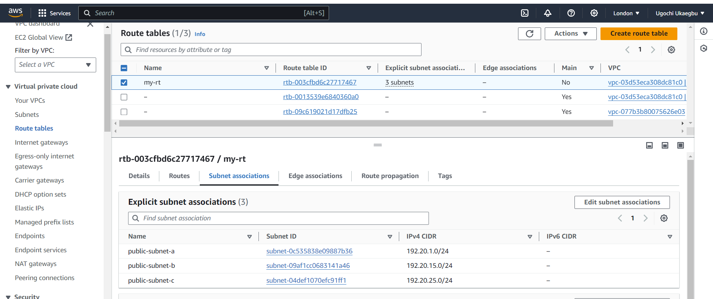
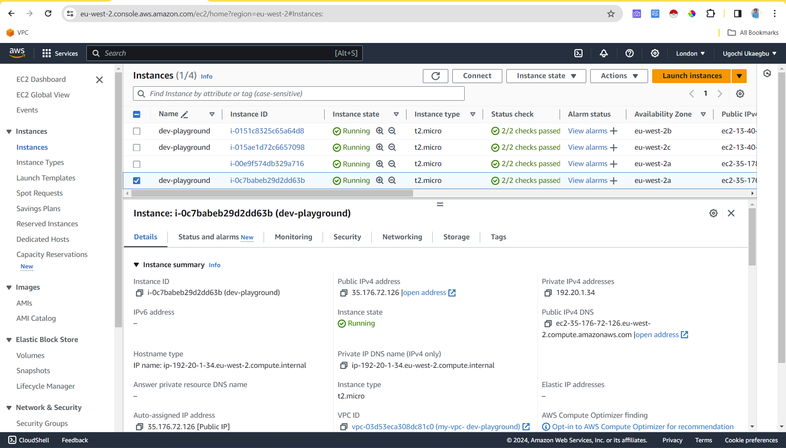
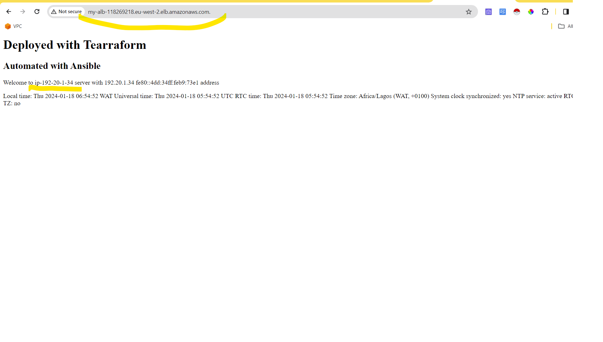
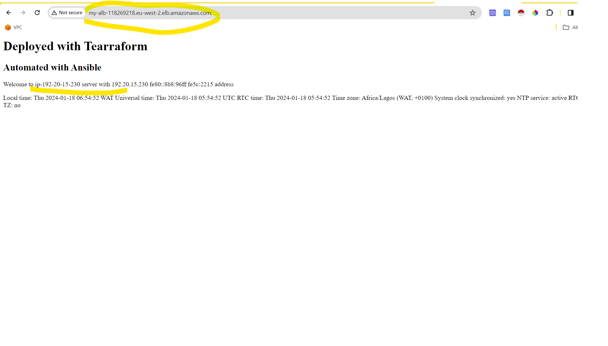
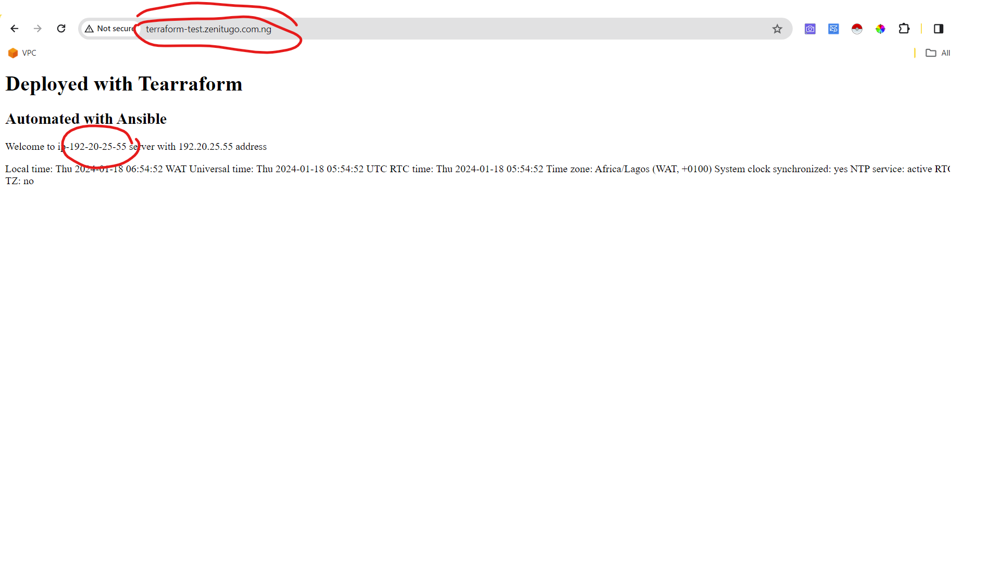
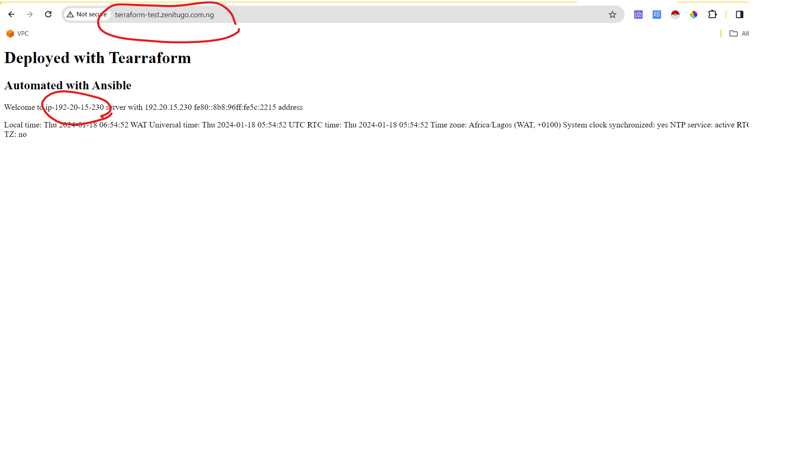

# PROJECT OVERVIEW
This project was focused on deploying three (ec2 servers) in which the web content could be accessed with a load balancer or a custom domain name with a subdomain initials of `terraform-test`. The steps involved in this process were:
- creating VPC
- creating ec2
- creating elastic load balancer
- creating route-53 zone
- Modularising the script by differentiating between child modules and root modules.
- creating a playbook
- creating a ansible configuration file
- as well as using the exported ips to create host-inventory.ini file.

In each of the folders different files names called `main.tf`, `variable.tf`, `data.tf` and `output.tf` can be found. 

The `main.tf` file holds the configurations to create the processes listed above.

The `data.tf` queries aws infrastructure to get the data needed.

The `output.tf` file hold the value of some of the resources created in the `main.tf` that will be needed to be called upon by other resources.

The `variable.tf` files helps make our script reusable so that we don't harcode in our main.tf.

For this project, the `main.tf` file was hardcoded which can be seen as the root modules in our Dev folder  with the variables in our `variable.tf`. 

# STEP BY STEP PROCESS OF EXECUTING TERRAFORM PROJECT
## STEP 1
The first step is to create a virtual private cloud(VPC). This requires using the terraform-aws resource name to create a resource block that would create:
- *vpc*

- *3 subnets* (Here a cidr subnet function was used to allocate private Ips to each subnet, a data block was used to query aws infrastructure to get the available availability zones and an instruction was given to allocate public ips to these subnets )

- *internet gateway* (This was attached to the vpc as well as attached to the route table)

- *route tables* (The three public subnets were associated to the route tables)

##  Step 2
The ec2 servers were also created making use of the terraform-aws resource name and the resource block to create the ec2 infrastructure. 

The resource block created:
1. Three ec2's. A single resource block was used to create the three ec2's beacause the count meta argument was used.

        - The file `bash.sh` was created to hold the file that will be displayed in the browser temporary so that when the ec2 is being created the bash script get executed and the hostname and ip of each server are retrieved.

        - The `file("${path.module}/bash.sh")` was placed in the user section of the ec2 resource block to let terraform know that the content to be executed in the user section and a command was given to terraform to send the output to this location */home/ubuntu/index.html.j2*

        - The public ips of the ec2 servers were exported by first using the local block to get the IPv4 address of each server and using `local_file` resource block with a command to join all three ips and export them to one file called `host-inventory.ini`

2. Public and private keys were created. They were both outputed using the resource name `local-file` and placed in a directory called `local_directory` so that it will be used to ssh into the controller machine since I am using a linux terminal provisioned with vagrant. The private key was also needed by the controller to ssh into the three ec2 servers. 

3. The security group for the three servers was created using an ingress rule of port 22 and port 80.

Also another resource block was inputted in the `main.tf` file to create an ec2 that will serve as the controller to provision the three ec2's. It used the keys already created for the three ec2's but had its own separate security group with an ingress of port 22.

The file `ansible.sh` was created to install ansible in the controller and create the directory structure for inputing the ansible commands and configurations.

## Step 3
The next step was to place the three ec2's behind an elastic load balancer. This required I also use the terraform-aws resource name and resource block to create:
- aplication load balancer (Here, an alb security group was created an attached to the load balancer as well as the sg for the ec2. A forward listener to port 80 was also attached to the alb)

- target group was created and a resource block to attach it to the instance id was also created
 

### Step 4
The final step was to attach our application load balancer to our custom domain name.

A hosted zone was created with the custom domain name and a record was created including the sub domain name`terraform-test` and attaching it to the alb using the alb `zone_id` and `dns_name`

# PROCESS OF DEPLOYING TERRAFORM PROJECT
To deploy this terraform project, you need to have Terraform installed on your machine. The assumption is that we are deploying to development; so we right click on the dev folder and open with an IDE and input the commands below.

The process of deploying the terraform resource are:
`terraform init` to initialise the terraform project.
`terraform plan` to review the code that will be executed.
`terraform apply -auto-approve` to deploy the terraform resource.

If you need to destroy the infrastructure make use of `terraform destroy -auto-approve`

# STEP BY STEP PROCESS OF EXECUTING ANSIBLE PROJECT
First, we have to install Ansible on your machine by running `install ansible` but this has been done by terraform in the controller machine.

The ansible.cfg file hold the configuration that will be used by the `playbook` and `host-inventory` files. 

The `host-inventory` file contains the different web servers name and ips that was exported by terraform.

`The playbook` contains instructionsnto install apache2, copy the contents that was executed in `bash.sh` to a new file `/var/www/index/html` and set the timezone on each server

The command used to execute this playbook was `ansible-playbook -i host-inventory.ini playbook.yml`

# OUTCOME OF THE PROJECT
After executing all the steps, the alb and domain name could successfully access  the contents in `/var/www/html/index.html` on three servers.

## USING THE APPLICATION LOAD BALANCER

## USING THE DOMAIN NAME (TERRAFORM-TEST.ZENITUGO.COM.NG)

